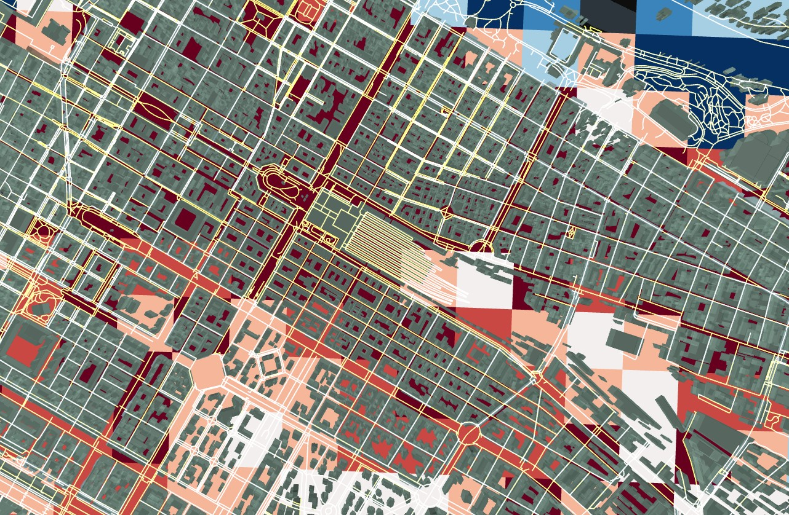
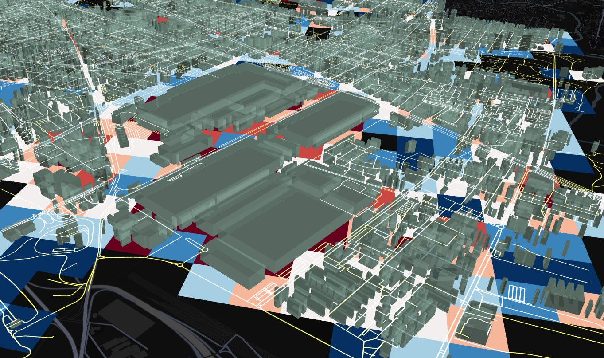
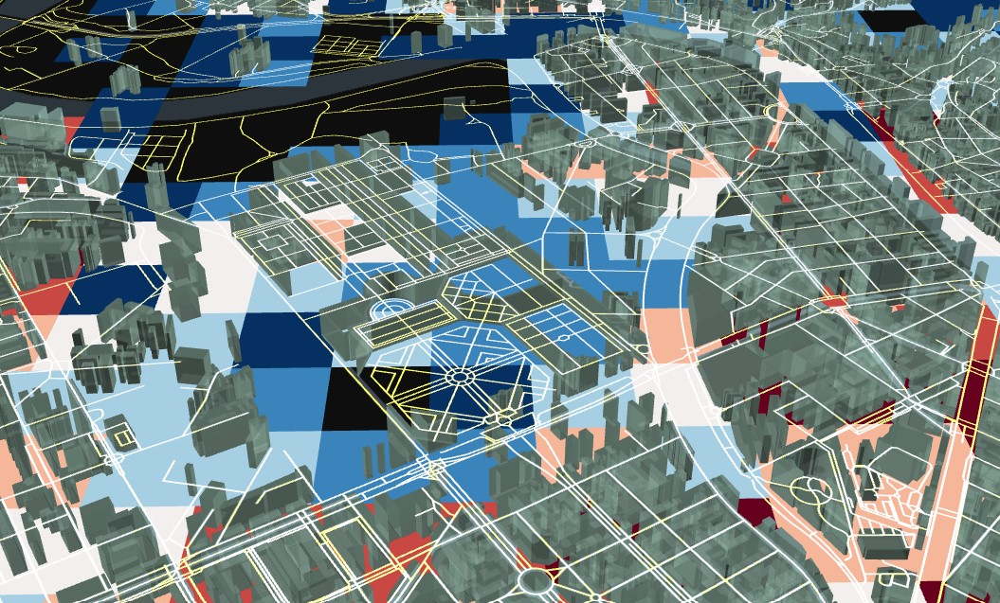
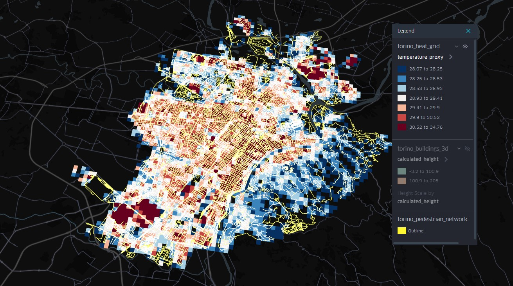

# 3D Heat Traps & Pedestrian Exposure in Torino

A spatial analysis pipeline that maps Torino's 3D urban geometry to find
"urban canyons" that trap heat, then overlays the pedestrian network and
demographic data to ask a concrete urban-planning question:

> **Are Torino's most vulnerable residents forced to navigate the most
> severe heat traps during their daily commute?**

Built with [OSMnx](https://github.com/gboeing/osmnx), [GeoPandas](https://geopandas.org/),
and visualized in [Kepler.gl](https://kepler.gl/).



## Why this approach

A flat temperature map tells you *where* it's hot. It doesn't tell you
whether that heat is concentrated in narrow, building-lined streets where
people on foot have no escape, or whether it overlaps with neighborhoods
with higher shares of elderly residents who are more physiologically
vulnerable to heat stress. Stacking 3D building geometry, a heat proxy, the
pedestrian network, and demographics in the same scene makes that
intersection visible and arguable, not just inferred.

| Dense canyon, heat trapped at street level | Open block, cooler microclimate |
|---|---|
|  |  |



## Pipeline overview

```
scripts/01_fetch_osm_geometry.py      → buildings (with height) + pedestrian network
scripts/02_generate_heat_grid.py      → 200m grid, urban density, temperature_proxy
scripts/03_integrate_demographics.py  → ISTAT population/elderly share joined to the grid
                                       ↓
                                kepler.gl/demo
                       (drag-and-drop the GeoJSONs, see docs/kepler_setup.md)
```

### 1. Urban geometry & pedestrian network (OpenStreetMap)

`scripts/01_fetch_osm_geometry.py` pulls Torino's building footprints via
OSMnx, resolves a usable height per building (actual `height` tag, falling
back to `building:levels` × 3.2m, falling back to a 15m default), and
extracts the walkable network (sidewalks, paths, pedestrianized zones).

```bash
python scripts/01_fetch_osm_geometry.py
```

Outputs:
- `data/processed/torino_buildings_3d.geojson` (`calculated_height` property)
- `data/processed/torino_pedestrian_network.geojson`

### 2. Heat grid (density proxy, upgradeable to real LST/MRT)

`scripts/02_generate_heat_grid.py` builds a uniform 200m × 200m grid,
intersects it with the buildings layer to compute urban density per cell,
and derives a `temperature_proxy` (28°C baseline + up to +6.5°C from
density). This is a fast, defensible stand-in for real microclimate data —
see [`docs/heat_data_sources.md`](docs/heat_data_sources.md) for how to swap
it out for actual Landsat/Sentinel Land Surface Temperature or a SOLWEIG
Mean Radiant Temperature simulation.

```bash
python scripts/02_generate_heat_grid.py
```

Output: `data/processed/torino_heat_grid.geojson`

### 3. Demographics (ISTAT)

`scripts/03_integrate_demographics.py` apportions ISTAT census-section
population (and elderly share) onto the same grid by area-weighted overlap.
See [`docs/demographic_data_sources.md`](docs/demographic_data_sources.md)
for where to get the ISTAT layer and how to set it up.

```bash
python scripts/03_integrate_demographics.py
```

Output: `data/processed/torino_demographics_grid.geojson`

### 4. Compose the scene in Kepler.gl

Drag the generated GeoJSONs into [kepler.gl/demo](https://kepler.gl/demo)
and style them as three (or four) layers — heat as a translucent ground
color, buildings extruded by height and colored dark for contrast, the
pedestrian network as thin bright lines, and demographics as an optional
hexbin/grid overlay. Full step-by-step styling instructions, including
color palette and opacity recommendations, are in
[`docs/kepler_setup.md`](docs/kepler_setup.md).

## Setup

```bash
python -m venv .venv
source .venv/bin/activate   # Windows: .venv\Scripts\activate
pip install -r requirements.txt
```

Then run the three scripts in order (1 → 2 → 3). Each one reads the output
of the previous step from `data/processed/`.


`data/` and the large Kepler exports (`kepler_gl.html`, `kepler_config.json`,
each 50MB+ once full-city data is embedded) are intentionally not committed.
See [`docs/kepler_setup.md`](docs/kepler_setup.md) for how to share or
version them (Git LFS, config-only export, or hosting the HTML separately).

## Caveats

- `temperature_proxy` in the default pipeline is a **density-based proxy**,
  not measured temperature — clearly label it as such in any write-up, and
  see `docs/heat_data_sources.md` to upgrade to real LST/MRT data.
- Population apportionment by area-weighted overlap is a simplification;
  dasymetric weighting by building footprint would be more accurate.
- OSM building height data is incomplete for parts of Torino; the 15m
  default and `building:levels` fallback introduce some uncertainty into
  the extrusion layer.

## License

MIT — see [LICENSE](LICENSE). OpenStreetMap data is © OpenStreetMap
contributors, ODbL. ISTAT data is subject to ISTAT's own terms of use.
